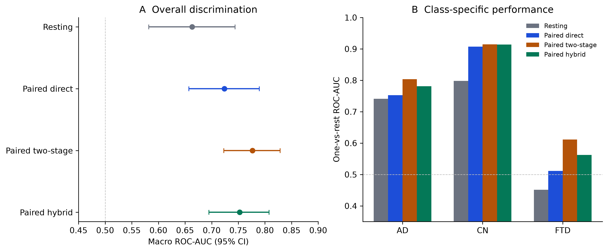

# EEG Slowing Transportability

[](https://github.com/noronhareuben1/eeg-slowing-transportability/actions/workflows/ci.yml)
[](LICENSE)
[](pyproject.toml)

**Compact resting EEG, spectral parameterization, rostrocaudal complexity, and
frequency-resolved photic responses for participant-level AD/FTD/CN analysis**

This repository tests a simple idea under increasingly difficult conditions:
can small, interpretable EEG measurements transfer beyond one dataset and help
distinguish Alzheimer disease (AD), frontotemporal dementia (FTD), and
cognitively normal controls (CN)?

The project contains a locked external AD/CN validation, two dated exploratory
amendments, and the original rostrocaudal-complexity validity audit. Results are
kept separate so internal model development is never mislabeled as external or
confirmatory evidence.

## Results at a glance

| Analysis | Validation unit | Main result | Claim boundary |
|---|---|---:|---|
| Locked three-feature slowing index | External P-ADIC AD/CN, n = 145 | ROC-AUC 0.702, 95% CI 0.611-0.788 | Transported modest discrimination; calibration and specificity were poor |
| Spectral amendment v1.1 | Internal AD/FTD/CN, n = 88 | Macro AUC 0.657 vs 0.578 baseline | Exploratory; external AD/CN AUC was essentially unchanged at 0.705 |
| Paired photic amendment v1.2 | Repeated nested AD/FTD/CN, n = 87 | Macro AUC 0.777, 95% CI 0.723-0.829 | Promising internal candidate; no independent paired validation |
| Paired v1.2 improvement | Same participants and folds | +0.113, paired 95% CI +0.035 to +0.191 | Supports the overall internal hypothesis only |
| FTD ranking in paired v1.2 | Same participants and folds | AUC 0.611; improvement CI -0.012 to +0.330 | FTD-specific hypothesis unsupported; sensitivity was 13.0% |
| Original complexity audit | Leakage-safe participant-level evaluation | Complexity fusion AUC 0.669; delta +0.032, p = 0.413 | Frozen hypotheses unsupported after multiplicity correction |

**Bottom line:** the locked slowing index transfers only modestly, compact
spectral additions do not materially improve external AD/CN discrimination,
and rostrocaudal complexity does not rescue the model. Frequency-resolved
photic responses improve internal three-class ranking, especially the AD/FTD
subtype head, but still require a newly locked independent cohort. This is not
a clinical diagnostic system or a state-of-the-art accuracy claim.



## Research tracks

### 1. Locked external transportability

The primary study fixes three features in OpenNeuro `ds004504` before one-way
evaluation in P-ADIC:

1. posterior relative delta-to-alpha ratio;
2. posterior relative alpha power;
3. global aperiodic exponent.

The external AUC was 0.702, but calibration slope was 0.383 and specificity at
the derivation-selected threshold was 0.490. The result supports feasibility,
not clinical deployment. Protocol: [transportability/protocol.md](transportability/protocol.md).

### 2. Compact spectral and complexity amendment

Amendment v1.1 tests periodic and aperiodic spectral parameters, rostrocaudal
gradients, and surrogate-controlled complexity. Spectral features improved the
internal three-class point estimate. The matched external spectral extension
changed AD/CN AUC by only +0.003, with a paired interval spanning zero.
Complexity additions did not improve on the spectral-only panel.

### 3. Paired resting and photic amendment

Amendment v1.2 combines the resting trait with the response to 5, 10, 15, and
20 Hz visual stimulation. A two-stage model first separates dementia from CN,
then uses a dedicated AD-versus-FTD head. Every feature selection, imputation,
scaling, and model choice occurs inside training participants in 10 x 5 repeated
nested validation.

The paired two-stage model reached macro AUC 0.777 versus 0.663 for resting EEG
alone. Its default FTD sensitivity remained 13.0%, so the next test must freeze
the feature panel and decision rule before an independent paired cohort is
opened.

### 4. Original complexity validity audit

The retained `rcd` pipeline reproduces and stress-tests the reported
rostrocaudal fractal-dimension effect using spectrum-preserving IAAFT
surrogates, paired photic data, classical models, and EEGNet with participant
grouping. All five frozen hypotheses were unsupported after Holm correction.

## Public datasets

- OpenNeuro `ds004504` v1.0.9: eyes-closed EEG, 36 AD, 23 FTD, and 29 CN,
  DOI [`10.18112/openneuro.ds004504.v1.0.9`](https://doi.org/10.18112/openneuro.ds004504.v1.0.9),
  CC0.
- OpenNeuro `ds006036` v1.0.6: paired photic EEG from the same cohort,
  DOI [`10.18112/openneuro.ds006036.v1.0.6`](https://doi.org/10.18112/openneuro.ds006036.v1.0.6),
  CC0.
- P-ADIC Dryad `10.5061/dryad.8gtht76pw`: independent routine EEG for
  external AD/CN validation, CC0. The focused AD and control download is about
  11 GB.

Raw EEG is never committed. See [DATA_LICENSES.md](DATA_LICENSES.md).

## Installation

Python 3.11 is the supported environment.

```bash
python -m venv .venv
# Windows: .venv\Scripts\activate
# macOS/Linux: source .venv/bin/activate
python -m pip install --upgrade pip
python -m pip install -e ".[dev]"
```

Install the optional PyTorch dependency only for the EEGNet stage:

```bash
python -m pip install -e ".[ml]"
```

## Reproduce the transportability analyses

First produce the resting `ds004504` regional features with the retained core
pipeline:

```bash
rcd download --dataset ds004504 --derivatives-only
rcd download --dataset ds006036 --derivatives-only
rcd validate-data
rcd run-reproduction
rcd run-mechanistic --n-surrogates 20
rcd run-state
rcd run-classical
rcd make-report
```

Download and verify the locked P-ADIC files, then build the two compatible
feature tables and run the untouched external test:

```bash
eeg-download-padic --output data/p_adic/raw
eeg-derive-locked \
  --regional outputs/mechanistic/regional_features.csv \
  --output outputs/transportability/derivation_features.csv
eeg-extract-padic \
  --input data/p_adic/raw \
  --output outputs/transportability/external_padic_features.csv
eeg-external-validate \
  --derivation outputs/transportability/derivation_features.csv \
  --external outputs/transportability/external_padic_features.csv \
  --output outputs/transportability/external_validation_results.json
```

Run the dated amendments:

```bash
eeg-amend-v1-1 --project-root . --outer-repeats 10 --bootstrap-iterations 2000
eeg-photic-features --project-root . --n-jobs 4
eeg-amend-v1-2 \
  --project-root . \
  --outer-repeats 10 \
  --bootstrap-iterations 5000 \
  --n-jobs 4
```

See [docs/reproducibility.md](docs/reproducibility.md) for expected values,
stage outputs, and frozen-versus-exploratory boundaries.

## Software checks

The data-free suite includes 20 tests; the PyTorch test is skipped when the
optional dependency is absent.

```bash
ruff check src tests transportability
pytest
```

## Repository map

| Path | Contents |
|---|---|
| `transportability/protocol.md` | Locked external AD/CN protocol |
| `transportability/amendment_v1_1.md` | Dated compact spectral and complexity amendment |
| `transportability/amendment_v1_2.md` | Dated paired perturbational amendment |
| `transportability/` | Download, feature, external-validation, and amendment code |
| `src/rcd/` | Original complexity, surrogate, prediction, and reporting pipeline |
| `outputs/transportability/` | Locked external results and compatible feature tables |
| `outputs/amendment_v1_1/` | Compact-model results and participant predictions |
| `outputs/amendment_v1_2/` | Paired-model results, selection frequencies, and figure |
| `manuscript/` | Complexity-audit manuscript and transportability validation draft |

## Interpretation limits

- P-ADIC externally validates AD versus controls only; it does not contain the
  FTD and matched photic data needed to validate the paired three-class model.
- `ds004504` and `ds006036` contain the same people. Their pairing tests state
  dependence but is not external validation.
- The paired v1.2 model was developed after earlier outcomes were known.
- The FTD operating point is poor despite improved rank discrimination.
- Differences from higher-scoring papers may reflect validation unit, leakage
  control, split repetition, feature selection, and cohort composition.
- No result establishes diagnosis, prognosis, universal applicability, or
  patient-level clinical utility.

## Citation and license

Use [CITATION.cff](CITATION.cff) for the software release and cite every source
dataset used. Source code is MIT licensed. Original project documentation and
figures are released under CC BY 4.0. This is exploratory research software,
not a medical device.
